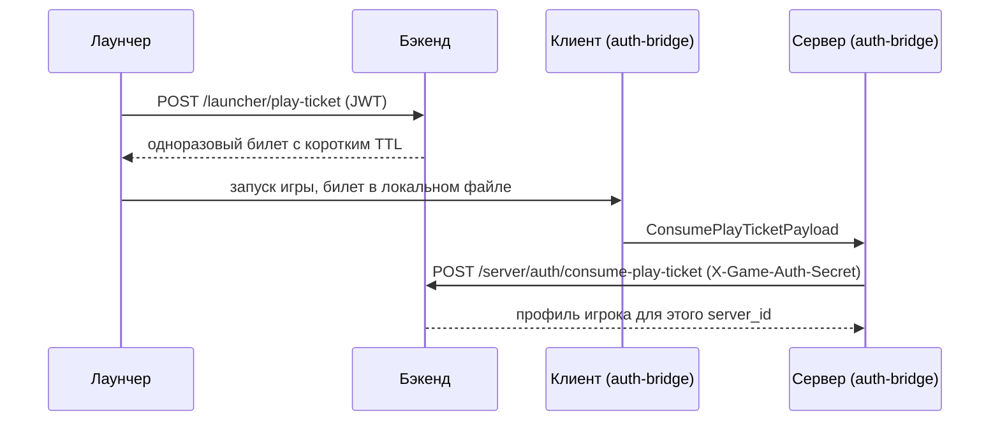

# Как сервисы общаются между собой

Все пути — относительно `https://api.void-rp.ru/api/v1`. Проверено по коду
[minecraft-backend](https://github.com/VOIDRP-MINECRAFT/minecraft-backend) (`apps/api/app/api/routes`).

## Кто есть кто: сервер и игрок

| Запрос приходит от | Как бэкенд понимает сервер |
|---|---|
| Мода или плагина | заголовок `X-Game-Auth-Secret` — у каждого сервера свой секрет |
| Сайта или лаунчера | `?server=<slug>` → заголовок `X-Server-Slug` → сервер по умолчанию; неизвестный slug — `404` |

Слаги серверов: `voidrp`, `origins`. Аккаунт (`users`, `player_accounts`) общий, игровые данные
(30+ таблиц) скоупятся по `server_id`.

## Вход на модовый сервер: play-ticket



Билет выдаётся только после принятия актуальной оферты и согласия на обработку ПДн.
Остальные эндпоинты `auth-bridge` (все с `X-Game-Auth-Secret`):

| Метод | Путь | Зачем |
|---|---|---|
| `POST` | `/server/auth/legacy-login` | вход паролем, если билета нет |
| `POST` | `/server/auth/player-access` | можно ли игроку на сервер |
| `GET` | `/server/auth/player-skin/{player_name}` | скин для раздачи клиентам |
| `GET` | `/server/auth/settings` | таймауты входа, применяются без рестарта |

## Вход на плагинный сервер (Origins)

[`voidrp-auth-plugin`](https://github.com/VOIDRP-MINECRAFT/voidrp-auth-plugin) показывает окна
входа и регистрации в фазе конфигурации, до входа в мир. Пароль проверяет бэкенд:

| Метод | Путь | Зачем |
|---|---|---|
| `GET` | `/server/auth/game/account/{nickname}` | есть ли аккаунт, какие документы не приняты |
| `POST` | `/server/auth/game/login` | вход паролем (с блокировкой ника после серии ошибок) |
| `POST` | `/server/auth/game/register` | регистрация настоящего аккаунта сайта |
| `POST` | `/server/auth/game/consents` | принять оферту и согласия прямо в игре |
| `POST` | `/server/auth/game/launcher-ticket` | мгновенный вход игрока из лаунчера — метка билета в адресе подключения |
| `POST` | `/server/auth/game/seen` | засчитать вход без окна пароля (сохранённая сессия или билет лаунчера) |

Клиенты старше 1.21.6 диалогов не понимают и входят командами `/login` и `/register`.

## Игровая синхронизация

Плагины и моды ходят в `/game-sync/*` с `X-Game-Auth-Secret`: статистика, нации, рынок игроков
(`/game-sync/player-market/*`), рынок наций, косметика, Void Coins, античит, торговец и т. д.
`GET /game-sync/server` возвращает сам вызывающий сервер и его админ-переключатели.

## WebGUI (модовый клиент)

- Каналы плагина: `webgui:open_web` — `VarInt(1) + VarInt(mode: 0=GUI, 1=HUD) + MCString(url)`,
  `webgui:set_main_menu` — `MCString(url)` (меню по <kbd>F6</kbd>).
- К URL добавляется `?webgui_token=<HMAC-SHA256>`; страницы `void-rp.ru/game-ui/*` ходят с ним в `/game-ui/*`.
- Подробно — [WEBGUI_ARCHITECTURE.md](WEBGUI_ARCHITECTURE.md).

## Публичные эндпоинты

| Метод | Путь | Ответ |
|---|---|---|
| `GET` | `/health` | `{"status": "ok", ...}` |
| `GET` | `/server/status?server=<slug>` | `{"online": true, "players_online": N, "players_max": M}` или `{"online": false}` |
| `GET` | `/server/stats` | число игроков и наций |

`/server/status` удобно использовать для бейджей онлайна, например:

```markdown

```
