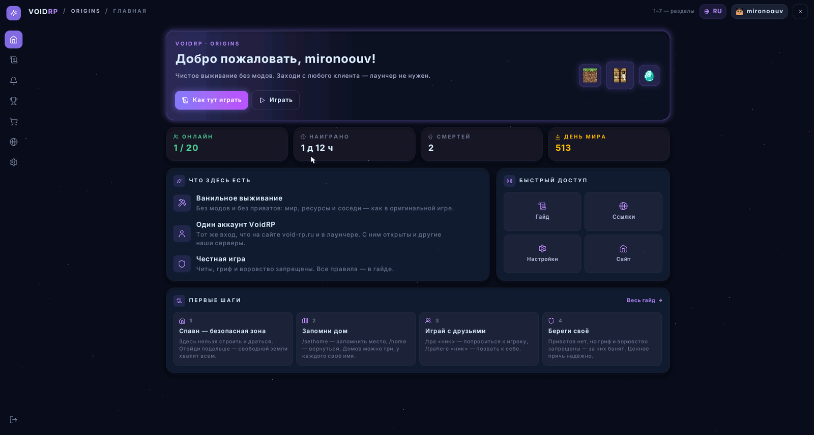
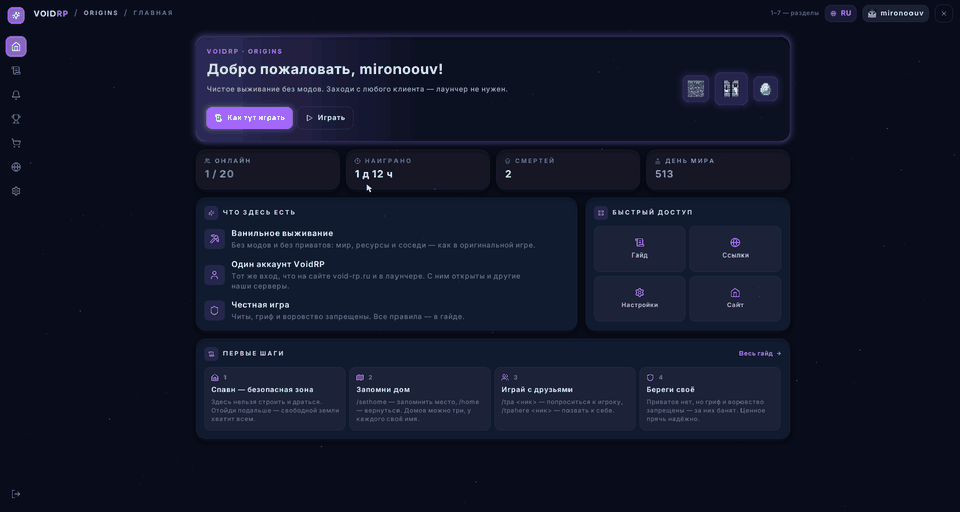
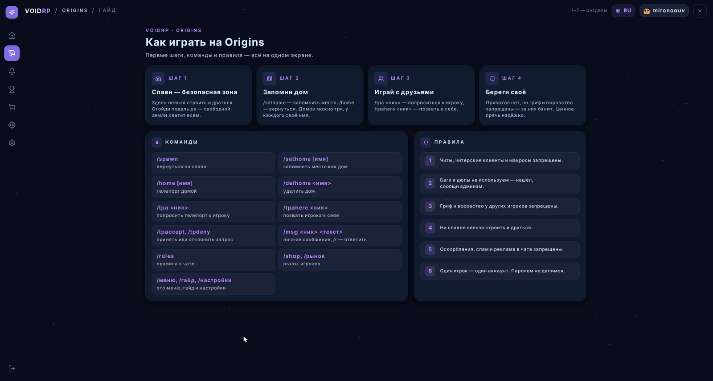
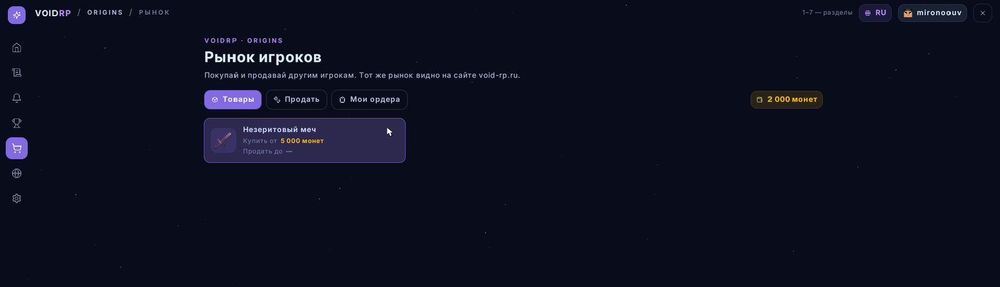
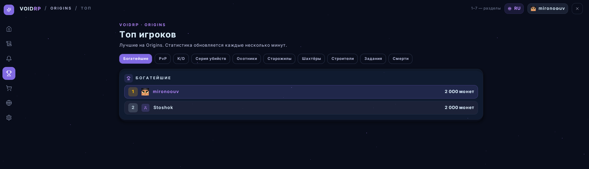
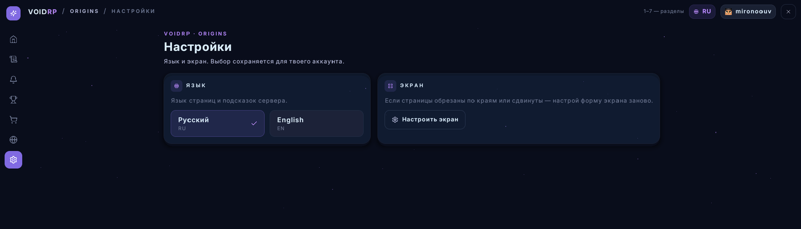
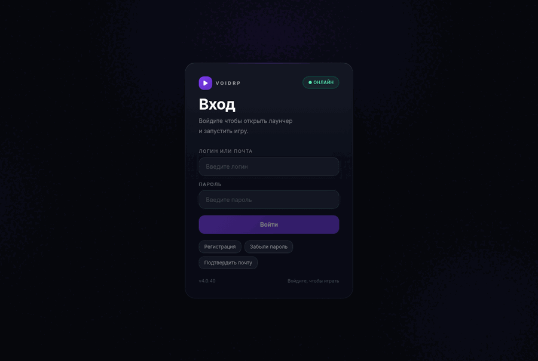
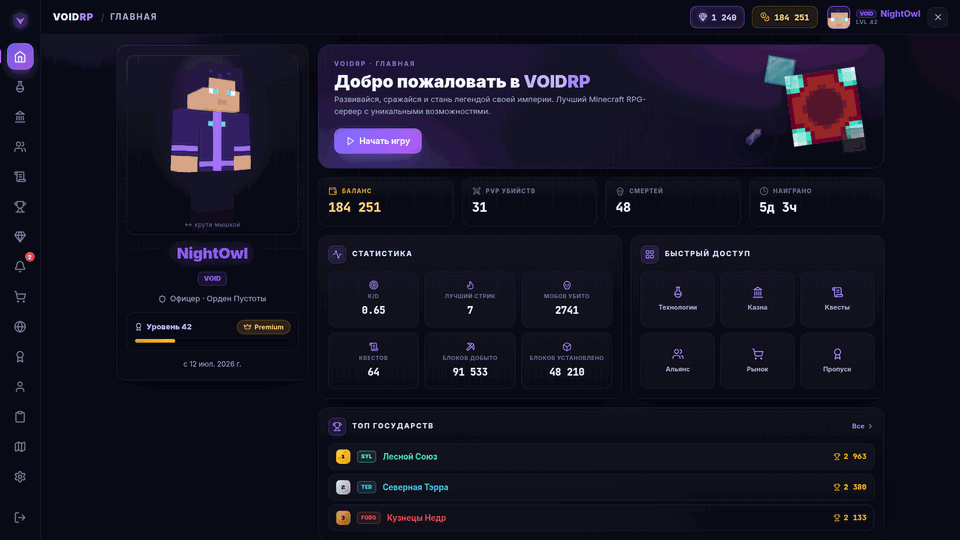

<div align="center">


<br>

[](https://void-rp.ru)
[](https://discord.gg/Af855xa5wT)
[](https://t.me/voidRPminecraft)
[](https://void-rp.ru/map)

[](https://modrinth.com/plugin/voidrp-ui)
[](https://hangar.papermc.io/mironoouv/VoidRP-UI)
[](https://github.com/VOIDRP-MINECRAFT/voidrp-ui/releases/latest)
[](https://github.com/VOIDRP-MINECRAFT/voidrp-ui/blob/main/LICENSE)

**[Servers](#servers)** · **[Getting started](#start)** · **[Screenshots](#screenshots)** · **[VoidRP UI](#voidrp-ui)** · **[Architecture](#architecture)** · **[Repositories](#repositories)** · **[Developers](#developers)**

<sub>🇷🇺 [Русская версия](https://github.com/VOIDRP-MINECRAFT) · 📚 [Developer docs](../docs) (Russian)</sub>

</div>

---

**VoidRP** is a Minecraft platform with one account for several worlds. Login, profile, skin,
donations and consents are shared; gameplay is per server — nations, economy, statistics and
anticheat data are kept apart for each one. Everything from the launcher and the website to the
server mods, plugins and the API is developed in this organisation. The servers are Russian-speaking;
VoidRP UI is open source and made for any server.

<a id="servers"></a>

## 🎮 Servers

<table>
<tr>
<td width="50%" valign="top">


<sub>In-game on VoidRP</sub>

### 🏰 VoidRP — a modded roleplay world

The **FTB Evolution** modpack on **Mohist 1.21.1** (NeoForge + Paper).

- 🏛️ **Nations and alliances**: treasury, diplomacy, votes, territories on the map
- 💹 **Living economy**: dynamic prices, a player market, a shop for modded items, a wealth tax
- 🎟️ **Battle pass**: Free/Premium, 100 levels plus prestige, daily quests
- 🧳 **Wandering trader**: an NPC with rare offers on a schedule
- 🖥️ **In-game WebGUI**: website pages over the game in embedded Chromium, menu on <kbd>F6</kbd>
- 🎨 **Cosmetics**: CPM models built on top of the player's skin

**Joining:** through the [VoidRP launcher](https://void-rp.ru/download-launcher), which installs the modpack and Java.

[](https://void-rp.ru/servers)

</td>
<td width="50%" valign="top">


<sub>The Origins menu home — a vanilla client, no mods</sub>

### 🌱 Origins — vanilla survival

Plain **Paper 26.2**: no mods, no modpack, no launcher required.

- 🔓 **Any client** from 1.21.1 to 26.x
- 🪟 **Log in through a Minecraft dialog** with the VoidRP account password, or register in-game
- 🧭 **`/меню` on vanilla**: guide, news, top players, settings, RU/EN (client 1.21.6+)
- 🛒 **Player market** shared with the website: `/shop` in-game
- 🏠 **Classic survival**: three homes, `/tpa`, PvP everywhere but spawn, items drop on death
- ⚠️ No land claims, but griefing and stealing are against the rules

**Address:** `origins.void-rp.ru:25567`

[](https://void-rp.ru/servers)

</td>
</tr>
</table>

<a id="start"></a>

## 🚀 Getting started

| | 🏰 VoidRP | 🌱 Origins |
|---|---|---|
| **1** | [Sign up at void-rp.ru](https://void-rp.ru/register) — one account for every server | [Sign up at void-rp.ru](https://void-rp.ru/register) or right in the game |
| **2** | [Download the launcher](https://void-rp.ru/download-launcher) (Windows, Linux) | Start Minecraft 1.21.1 – 26.x in any launcher |
| **3** | Pick **VoidRP** and press Play: modpack, Java and login are handled for you | Add `origins.void-rp.ru:25567` and enter your password in the login dialog |

> [!TIP]
> From the VoidRP launcher you join Origins without a password: a one-time login ticket travels in the connection address.

<a id="screenshots"></a>

## 🖼️ Screenshots

### 🌱 The Origins menu on a vanilla client

Real screenshots from the Origins server: the `/меню` menu on a plain client with no mods, drawn by VoidRP UI. Sections switch by click, scroll wheel or keys 1–7.

<div align="center">


<sub>Home → guide → market → top players → settings</sub>
</div>

<table>
<tr>
<td width="50%"><br><sub>Guide: first steps, commands and rules</sub></td>
<td width="50%"><br><sub>Player market — the same one as on the website</sub></td>
</tr>
<tr>
<td width="50%"><br><sub>Top players: richest, PvP, K/D, miners, builders…</sub></td>
<td width="50%"><br><sub>Settings: RU/EN language and screen shape</sub></td>
</tr>
</table>

### 🧩 VoidRP UI: cursor, themes, components

<div align="center">


<sub>A vanilla client, recorded at real speed. The player turns their head, the cursor follows, and whatever it points at lights up.<br>
Not a mod and not a mock-up: every rectangle, letter and icon arrives from the server as one line of text in an invisible boss bar.</sub>

</div>

### One page, four themes

<div align="center">


<sub>Same code, different <code>theme.yml</code>: midnight → daylight → ember → grove</sub>
</div>

<details>
<summary><b>Components: buttons, switches, sliders, tabs, dialogs</b></summary>
<br>


</details>

### 🌐 Website, launcher and in-game pages

<div align="center">


<sub>The <a href="https://void-rp.ru">void-rp.ru</a> website: home → servers → player market → nations → top players → battle pass</sub>
</div>

<table>
<tr>
<td width="50%"><br><sub><b>Launcher</b>: sign in → server → Play → nation → rankings → settings</sub></td>
<td width="50%"><br><sub><b>WebGUI</b> over the game on VoidRP: menu (F6) → battle pass → quests → market</sub></td>
</tr>
</table>

<sub>The website, launcher and WebGUI were captured from local builds with demo data: nicknames, nations and prices are made up.</sub>

<a id="voidrp-ui"></a>

## ✨ VoidRP UI — real interfaces on a vanilla client

A server interface in Minecraft is usually a chest full of items, and anything richer needs a client mod.
[**VoidRP UI**](https://github.com/VOIDRP-MINECRAFT/voidrp-ui) draws panels with rounded corners, opacity,
the Inter typeface, item icons and a live cursor **on the client players already have** — they only accept
the server's resource pack. A page is code, built on the server when it is shown, so it can display data
that did not exist when the pack was made.

<table>
<tr>
<td valign="top">

**Download**

- [Modrinth](https://modrinth.com/plugin/voidrp-ui)
- [Hangar](https://hangar.papermc.io/mironoouv/VoidRP-UI)
- [GitHub Releases](https://github.com/VOIDRP-MINECRAFT/voidrp-ui/releases/latest)
- [JitPack](https://jitpack.io/#VOIDRP-MINECRAFT/voidrp-ui) for your own plugins

</td>
<td valign="top">

**Compatibility**

- Server: **Paper** (API 26.2; the jar targets Java 21 and loads on 1.21.6)
- Clients: **1.21.6 – 26.x**, two resource packs are built for old and new
- Nothing to install for players, **MIT** licence
- Optional [PacketEvents](https://modrinth.com/plugin/packetevents): up to 50 ms snappier cursor

</td>
<td valign="top">

**Docs**

- [Layout](https://github.com/VOIDRP-MINECRAFT/voidrp-ui/blob/main/docs/layout.md)
- [Pages](https://github.com/VOIDRP-MINECRAFT/voidrp-ui/blob/main/docs/page.md)
- [Components](https://github.com/VOIDRP-MINECRAFT/voidrp-ui/blob/main/docs/components.md)
- [Theming](https://github.com/VOIDRP-MINECRAFT/voidrp-ui/blob/main/docs/theming.md)
- [Responsive](https://github.com/VOIDRP-MINECRAFT/voidrp-ui/blob/main/docs/responsive.md)
- [Internals](https://github.com/VOIDRP-MINECRAFT/voidrp-ui/blob/main/docs/internals.md)

</td>
</tr>
</table>

<a id="architecture"></a>

## 🏗️ Architecture

<div align="center">
<picture>
  <source media="(prefers-color-scheme: dark)" srcset="diagrams/architecture-dark.svg">
  
</picture>
</div>

<sub>Diagram sources: [`profile/diagrams/*.puml`](diagrams) (PlantUML, labels in Russian).</sub>

- **One account, separate worlds.** `users` / `player_accounts` are global; gameplay data (30+ tables) is scoped by `server_id`. Plugins and mods identify their server with `X-Game-Auth-Secret`, the site and launcher with `X-Server-Slug`.
- **Launcher.** Vue 3 renderer + Electron + a .NET 8 core. Syncs the pack by manifest with up to 8 parallel downloads and SHA-256 checks, keeps each server in `servers/<slug>/`, never overwrites the player's keys and graphics settings, and offers fixes after a crash using rules sent by the server.
- **No password in the game.** The launcher gets a one-time `play-ticket`; on the modded server `auth-bridge` checks it, on Origins it rides in the connection address. A vanilla client logs in through a native Minecraft dialog, and the password is checked by the website, never stored on the server.
- **Interfaces.** Modded clients get HTML/Vue pages in embedded Chromium (MCEF) signed with an HMAC `webgui_token`; vanilla clients get VoidRP UI.
- **Economy.** `gamesync-plugin` bridges EconomyShopGUI to modded items with dynamic prices; the player market takes 2% (1% with Premium); a scheduled trader NPC unlocks stock by battle-pass level.
- **Stability.** 65 mixins in `async-ai` (23 of them close paths to chunk deadlocks), a server-side anticheat with mod snapshots, and a watchdog that catches hangs and can call Claude for diagnostics.

<a id="repositories"></a>

## 📦 Repositories

| Area | Repository | What it does |
|---|---|---|
| Platform | [minecraft-backend](https://github.com/VOIDRP-MINECRAFT/minecraft-backend) | REST API: accounts, multi-server, nations, economy, trader, consents, anticheat, admin (Python · FastAPI) |
| Platform | [voidrp-site](https://github.com/VOIDRP-MINECRAFT/voidrp-site) | void-rp.ru and the in-game `/game-ui/*` pages (Vue 3 · Vite · Tailwind) |
| Launcher | [voidrp-launcher-vue](https://github.com/VOIDRP-MINECRAFT/voidrp-launcher-vue) | Main launcher (Electron · Vue 3 · .NET 8) |
| Launcher | [voidrp-launcher-java](https://github.com/VOIDRP-MINECRAFT/voidrp-launcher-java) | Fallback single-JAR launcher (JavaFX 21) |
| Vanilla | [**voidrp-ui**](https://github.com/VOIDRP-MINECRAFT/voidrp-ui) ⭐ | Interfaces on a vanilla client, no mods (Paper · Kotlin · MIT) |
| Vanilla | [voidrp-auth-plugin](https://github.com/VOIDRP-MINECRAFT/voidrp-auth-plugin) | Log in and sign up with the website account through Minecraft dialogs (Paper 26.2) |
| NeoForge | [voidrp-async-ai](https://github.com/VOIDRP-MINECRAFT/voidrp-async-ai) | Performance and deadlock guards, 65 mixins |
| NeoForge | [voidrp-anticheat](https://github.com/VOIDRP-MINECRAFT/voidrp-anticheat) | Speed, Fly, Reach, KillAura, CPS, client mod snapshots |
| NeoForge | [voidrp-auth-bridge](https://github.com/VOIDRP-MINECRAFT/voidrp-auth-bridge) | Play-ticket login, reconnects, skins |
| NeoForge | [voidrp-webgui-neoforge](https://github.com/VOIDRP-MINECRAFT/voidrp-webgui-neoforge) | Embedded Chromium pages and HUD |
| NeoForge | [voidrp-cpm-companion](https://github.com/VOIDRP-MINECRAFT/voidrp-cpm-companion) | Cosmetics through Customizable Player Models |
| NeoForge | [wg-region-guard](https://github.com/VOIDRP-MINECRAFT/wg-region-guard) | Stops mod mechanics from breaking WorldGuard regions |
| NeoForge | [voidrp-client-fixes](https://github.com/VOIDRP-MINECRAFT/voidrp-client-fixes) | Client-only crash guards for the modpack |
| Paper | [voidrp-gamesync-plugin](https://github.com/VOIDRP-MINECRAFT/voidrp-gamesync-plugin) | Backend sync, modded-item shop, player market, WebGUI bridge, trader |
| Paper | [voidrp-battlepass](https://github.com/VOIDRP-MINECRAFT/voidrp-battlepass) | Seasons, Free/Premium, 100 levels plus prestige |
| Paper | [voidrp-daily-quests](https://github.com/VOIDRP-MINECRAFT/voidrp-daily-quests) | Daily quests, the three-day hero trial, deliveries |
| Paper | [voidrp-wealth-tax](https://github.com/VOIDRP-MINECRAFT/voidrp-wealth-tax) | Progressive wealth tax that takes money out of the economy, optionally a share to the nation treasury |
| Paper | [voidrp-mod-sell](https://github.com/VOIDRP-MINECRAFT/voidrp-mod-sell) | Selling modded items with `/modsell` at the server economy prices; counts towards daily quests |

<sub>🗄️ Archived: [voidrp-webgui](https://github.com/VOIDRP-MINECRAFT/voidrp-webgui), the Fabric WebGUI fork replaced by voidrp-webgui-neoforge.</sub>

<a id="developers"></a>

## 🧑‍💻 Developers

A VoidRP UI page in fifteen lines:

```kotlin
class ShopPage(private val balance: Int) : Page() {

    override fun view(): View = Panel(
        style = Theme.page,
        width = Size.Fixed(600),
        gap = Theme.SPACE_4,
        children = listOf(
            Text("Shop", Theme.TEXT_H2, Theme.INK, Weight.SEMIBOLD),
            Text("Balance: $balance", Theme.TEXT_BODY, Theme.INK_SOFT),
            Panel(
                direction = Direction.ROW,
                gap = Theme.SPACE_3,
                align = Align.CENTER,
                children = listOf(Image("diamond", 32), Text("Diamond — 100")),
            ),
            button("Buy", id = "buy"),
        ),
    )

    override fun onClick(id: String, button: Button) {
        if (id == "buy") { /* ... */ refresh() }
    }
}

plugin.pages.open(player, ShopPage(balance))
```

```kotlin
repositories { maven("https://jitpack.io") }

dependencies {
    compileOnly("com.github.VOIDRP-MINECRAFT:voidrp-ui:v0.3.17")
}
```

Issues and pull requests are welcome — see [CONTRIBUTING](../CONTRIBUTING.md) and [SECURITY](../SECURITY.md).

---

<div align="center">

**[🌐 Website](https://void-rp.ru)** · **[🖥️ Servers](https://void-rp.ru/servers)** · **[📥 Launcher](https://void-rp.ru/download-launcher)** · **[🗺️ Map](https://void-rp.ru/map)** · **[💬 Discord](https://discord.gg/Af855xa5wT)** · **[✈️ Telegram](https://t.me/voidRPminecraft)** · **[🟢 Modrinth](https://modrinth.com/plugin/voidrp-ui)**

</div>
