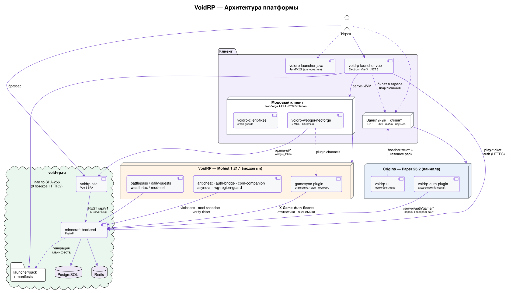
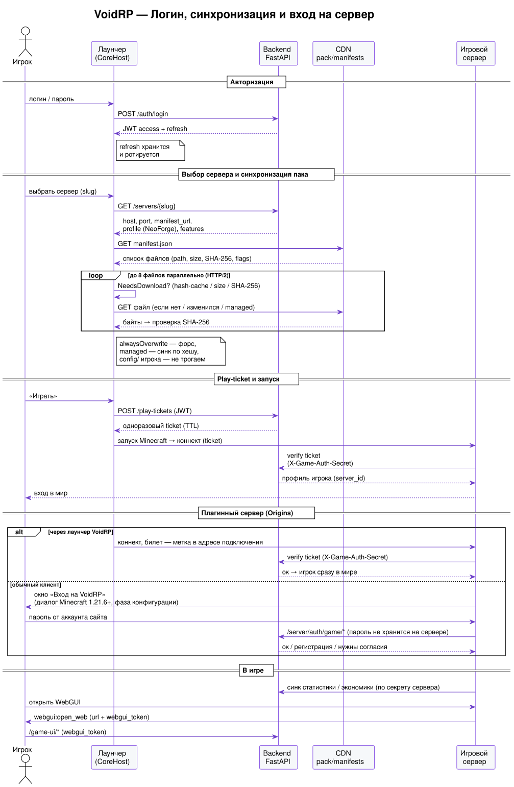

# 🗡️ VoidRP Minecraft

> **Мультисерверная Minecraft-платформа: один аккаунт — разные миры. От ролевого сервера с экономикой и нациями до хардкорной анархии.**

[](https://void-rp.ru)
[](https://void-rp.ru/servers)
[](https://mohistmc.com)
[](https://neoforged.net)
[](https://github.com/VOIDRP-MINECRAFT/minecraft-backend)

---

## 🌐 Платформа

Единый аккаунт VoidRP — **несколько игровых серверов**. Аккаунт-слой (логины, профили,
скины, донат) общий на всю платформу, а вся игровая механика (нации, экономика,
статистика, приваты, античит) **разделена по серверам** — у каждого свои данные.

| Сервер | Что это | Стек |
|---|---|---|
| **🏰 VoidRP** | Ролевой мир: нации и альянсы, динамическая экономика, рынок модовых предметов, боевой пропуск, квесты | Mohist 1.21.1 (Paper + NeoForge) |
| **💀 Abyss** | Хардкорная анархия: приваты через блок-ядро, рейды, награды за головы, killfeed, свои скины | NeoForge 26.2 · Java 25 · offline-mode |

---

## 🏗️ Стек технологий

```
┌──────────────────────────────────────────────────────────────────────┐
│                          VoidRP Architecture                          │
├──────────────┬───────────────────────────┬───────────────────────────┤
│   Launcher   │        Minecraft          │          Backend          │
│              │                           │                           │
│  Electron    │  VoidRP: Mohist 1.21.1    │  FastAPI (Python)         │
│  Vue 3 · TS  │  Abyss:  NeoForge 26.2    │  PostgreSQL · Alembic     │
│  .NET 8      │  20+ кастомных модов       │  Redis · JWT              │
│  JavaFX 21   │  и плагинов                │  play-ticket auth         │
└──────────────┴───────────────────────────┴───────────────────────────┘
```

---

## 🗺️ Схема архитектуры

<div align="center">

</div>

> Исходники схем — [`profile/diagrams/*.puml`](diagrams) (PlantUML). Стрелки подписаны протоколом/секретом, по которому идёт обмен.

---

## 🔬 Как это работает

### 1. Единый аккаунт, разделённые миры
Аккаунт-слой (`users` / `player_accounts`) — **глобальный**: один логин, профиль,
скин и донат на всю платформу. Вся игровая механика скоупится по `server_id →
game_servers` (30+ таблиц: нации, экономика, статистика, приваты, античит…).
Сервер определяется двумя путями:
- **плагины/моды** — по заголовку `X-Game-Auth-Secret` (у каждого сервера свой секрет);
- **сайт/лаунчер** — по `?server=<slug>` → `X-Server-Slug` → дефолтному серверу.

### 2. Лаунчер: манифест и синхронизация
Лаунчер (CoreHost на .NET 8) тянет с сервера **манифест пака** (генерится бэкендом
из `pack_root`, URL — в `game_servers.manifest_url`) и сверяет локальные файлы:
- скачивание **до 8 файлов параллельно** (HTTP/2), кэш SHA-256 не пересчитывает хеши зря;
- флаги файла: `alwaysOverwrite` (форс), `managed` (синк по хешу — обновление доходит,
  но неизменное не перекачивается), обычные `config/`-файлы игрока не трогаются;
- файлы каждого сервера изолированы в `servers/<slug>/`; клиентский профиль NeoForge
  может отличаться от серверного (напр. voidrp: сервер 21.1.232, клиент 21.1.233).

### 3. Play-ticket авторизация
Вход в игру — **без передачи пароля**. Лаунчер по JWT запрашивает у бэкенда
одноразовый `play-ticket` (короткий TTL), сервер при коннекте проверяет его
(`auth-bridge` / бэкенд) и получает профиль игрока уже привязанным к `server_id`.

<div align="center">

</div>

### 4. Мод-прокси-шоп и экономика
На Mohist (NeoForge + Paper) EconomyShopGUI не умеет модовые предметы —
`gamesync-plugin` перехватывает транзакции, берёт цену из динамического
рыночного кэша (бэкенд-симуляция) и выдаёт предмет через `minecraft:give`.
Сделки конвертируются в XP боевого пропуска/квестов, комиссия идёт в казну нации.

### 5. WebGUI прямо в игре
Вместо инвентарных GUI — **HTML/Vue-страницы поверх игры** через встроенный
Chromium (MCEF). Сервер шлёт клиенту `webgui:open_web` (plugin channel) с URL и
`webgui_token` (HMAC), клиент открывает `void-rp.ru/game-ui/*`, страница ходит в
`/api/v1/game-ui/*` бэкенда.

### 6. Античит и производительность
Серверный `anticheat` считает нарушения (Speed/Fly/Reach/KillAura/CPS) в VL,
шлёт репорты и снимки списка модов в бэкенд (админ выносит вердикты по модам).
`async-ai` — 20+ guard-миксинов против chunk-deadlock и async AI; отдельный
watchdog собирает диагностику и авто-фиксит зависания.

---

## 📦 Репозитории

### 🖥️ Инфраструктура

| Репозиторий | Описание | Стек |
|---|---|---|
| [minecraft-backend](https://github.com/VOIDRP-MINECRAFT/minecraft-backend) | REST API платформы: авторизация, мультисервер, нации, экономика, приваты, античит | Python · FastAPI · SQLAlchemy · Alembic |
| [voidrp-site](https://github.com/VOIDRP-MINECRAFT/voidrp-site) | Сайт void-rp.ru: профили, нации, магазин, гайды, рейтинги, per-server вкладки | Vue 3 · Vite · Tailwind · daisyUI |

### 🚀 Лаунчер

| Репозиторий | Описание | Стек |
|---|---|---|
| [voidrp-launcher-vue](https://github.com/VOIDRP-MINECRAFT/voidrp-launcher-vue) | Десктопный лаунчер: выбор сервера, автообновление модпака, Java-рантайм | Electron · Vue 3 · TypeScript · .NET 8 |
| [voidrp-launcher-java](https://github.com/VOIDRP-MINECRAFT/voidrp-launcher-java) | Альтернативный лаунчер (standalone JAR) | JavaFX 21 · OkHttp · Gradle Shadow |

### 💀 Abyss (NeoForge 26.2)

| Репозиторий | Описание |
|---|---|
| [voidrp_claims](https://github.com/VOIDRP-MINECRAFT/voidrp_claims) | Приваты через блок-ядро: кубы 16×16×16, рейды взрывами + выкапывание ядра, raid-алерты |
| [voidrp_abyss](https://github.com/VOIDRP-MINECRAFT/voidrp_abyss) | Анархо-геймплей: награды за головы (алмазы), головы-трофеи, killfeed, координаты смерти, синк статистики |

### ⚔️ NeoForge моды (серверные)

| Репозиторий | Описание |
|---|---|
| [voidrp-async-ai](https://github.com/VOIDRP-MINECRAFT/voidrp-async-ai) | Производительность: async AI, защита от deadlock/chunk-freeze (60+ миксинов) |
| [voidrp-anticheat](https://github.com/VOIDRP-MINECRAFT/voidrp-anticheat) | Серверный античит: Speed, Fly, Reach, KillAura, CPS + mod-snapshot (мультиверсия 1.21.1 / 26.2) |
| [voidrp-auth-bridge](https://github.com/VOIDRP-MINECRAFT/voidrp-auth-bridge) | Бридж авторизации (play-ticket) + кастомные скины Abyss в offline-mode (мультиверсия) |
| [voidrp-cpm-companion](https://github.com/VOIDRP-MINECRAFT/voidrp-cpm-companion) | Косметика через CPM: гранты, экипировка, compositing скинов |
| [voidrp-webgui-neoforge](https://github.com/VOIDRP-MINECRAFT/voidrp-webgui-neoforge) | Встроенный Chromium WebGUI: открывает HTML-страницы поверх игры |
| ~~[voidrp-webgui](https://github.com/VOIDRP-MINECRAFT/voidrp-webgui)~~ | _(архив — Fabric-форк, заменён voidrp-webgui-neoforge)_ |

### 🔌 Paper/Mohist плагины

| Репозиторий | Описание |
|---|---|
| [voidrp-gamesync-plugin](https://github.com/VOIDRP-MINECRAFT/voidrp-gamesync-plugin) | Синхронизация статистики, прокси-шоп для модовых предметов, динамические цены |
| [voidrp-battlepass](https://github.com/VOIDRP-MINECRAFT/voidrp-battlepass) | Боевой пропуск: сезонные задания, XP, награды |
| [voidrp-daily-quests](https://github.com/VOIDRP-MINECRAFT/voidrp-daily-quests) | Ежедневные квесты с интеграцией в экономику |
| [voidrp-wealth-tax](https://github.com/VOIDRP-MINECRAFT/voidrp-wealth-tax) | Прогрессивный налог на богатство для балансировки экономики |
| [voidrp-mod-sell](https://github.com/VOIDRP-MINECRAFT/voidrp-mod-sell) | Продажа предметов из модов через единый интерфейс |
| [wg-region-guard](https://github.com/VOIDRP-MINECRAFT/wg-region-guard) | Расширение WorldGuard: защита регионов и нации |

---

## 🌍 Особенности серверов

### 🏰 VoidRP — ролевой мир
- **Нации и альянсы** — территориальная политика, казна, дипломатия
- **Динамическая экономика** — рыночные цены, налоги, торговля модовыми предметами
- **Боевой пропуск + квесты** — сезонный прогресс с ежедневными заданиями
- **Косметика** — CPM-модели с композитингом скина игрока

### 💀 Abyss — хардкорная анархия
- **Приваты через блок** — ядро защищает кубы 16×16×16; за пределами привата — чистая анархия
- **Рейды** — взрывы пробивают защиту, ядро выкапывается киркой; владельцу летит raid-алерт
- **Награды за головы** — алмазный bounty на игрока, выплата убийце
- **Головы-трофеи + killfeed** — с убитого падает его голова, все PvP-киллы в живой ленте «Пульс Abyss»
- **Свои скины** — собственная система скинов в offline-mode

### 🔧 Общее для платформы
- **Мультисервер** — один аккаунт, изолированные игровые данные по серверам
- **Античит** — серверная верификация движения + snapshot загруженных модов
- **60+ performance-миксинов** — нулевые chunk-deadlock'и, async AI, guard'ы для проблемных модов
- **Play-ticket auth** — безопасная авторизация лаунчер → сервер → API

---

## 📊 Технические достижения

```
✅ Мультисервер            — общий аккаунт, per-server игровые данные (30+ таблиц)
✅ Chunk-deadlock guards    — 20+ паттернов заблокировано
✅ Async watchdog           — автодиагностика и автофикс через Claude AI
✅ Mod proxy shop           — NeoForge предметы в Paper-магазине без рестарта
✅ Live skin compositing    — серверная генерация скинов (CPM + offline Abyss)
✅ Block-anchored claims    — кубовые приваты с рейдами прямо на анархии
✅ Play-ticket auth         — безопасная авторизация лаунчер → сервер → API
```

---

<div align="center">

**[🌐 Сайт](https://void-rp.ru)** · **[🖥️ Серверы](https://void-rp.ru/servers)** · **[💬 Discord](https://discord.gg/voidrp)** · **[🗺️ Карта](https://void-rp.ru/map)**

*VoidRP — твой мир, твои правила*

</div>
