<div align="center">

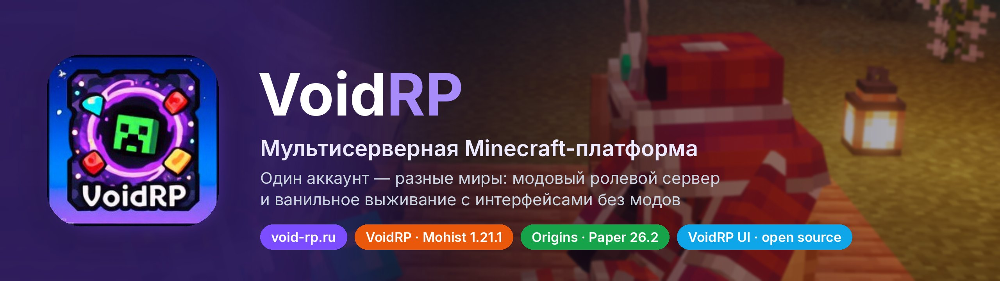

<br>

[](https://void-rp.ru)
[](https://discord.gg/j2Dvxm8E)
[](https://t.me/voidRPminecraft)
[](https://void-rp.ru/map)

[](https://modrinth.com/plugin/voidrp-ui)
[](https://hangar.papermc.io/mironoouv/VoidRP-UI)
[](https://github.com/VOIDRP-MINECRAFT/voidrp-ui/releases/latest)
[](https://github.com/VOIDRP-MINECRAFT/voidrp-ui/blob/main/LICENSE)

**[Серверы](#servers)** · **[Как начать](#start)** · **[Скриншоты](#screenshots)** · **[VoidRP UI](#voidrp-ui)** · **[Архитектура](#architecture)** · **[Репозитории](#repositories)** · **[Для разработчиков](#developers)**

<sub>🇬🇧 [English version](https://github.com/VOIDRP-MINECRAFT/.github/blob/main/profile/README.en.md) · 📚 [Документация для разработчиков](https://github.com/VOIDRP-MINECRAFT/.github/tree/main/docs)</sub>

</div>

---

**VoidRP** — это Minecraft-платформа с одним аккаунтом на несколько миров. Логин, профиль, скин,
донат и согласия общие, а игровая механика у каждого сервера своя: нации, экономика,
статистика и античит хранятся отдельно по серверам. Всё, от лаунчера и сайта до серверных
модов, плагинов и API, пишется в этой организации.

<a id="servers"></a>

## 🎮 Серверы

<table>
<tr>
<td width="50%" valign="top">

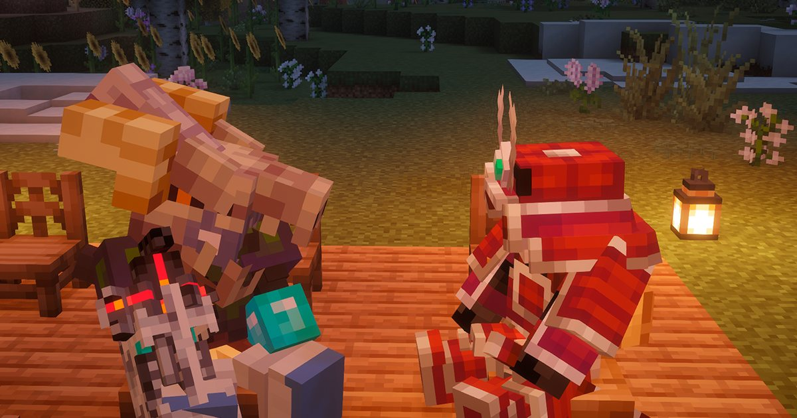
<sub>Кадр из игры на VoidRP</sub>

### 🏰 VoidRP — ролевой мир на модах

Модпак **FTB Evolution** на **Mohist 1.21.1** (NeoForge + Paper).

- 🏛️ **Нации и альянсы**: казна, дипломатия, голосования, территории на карте
- 💹 **Живая экономика**: динамические цены, рынок игроков, магазин модовых предметов, налог на богатство
- 🎟️ **Боевой пропуск**: Free/Premium, 100 уровней и престиж, ежедневные квесты
- 🧳 **Странствующий торговец**: NPC с редкими лотами по расписанию
- 🖥️ **WebGUI в игре**: страницы сайта поверх игры во встроенном Chromium, меню по <kbd>F6</kbd>
- 🎨 **Косметика**: CPM-модели, собранные со скином игрока

**Вход:** через [лаунчер VoidRP](https://void-rp.ru/download-launcher), он сам ставит модпак и Java.

[](https://void-rp.ru/servers)

</td>
<td width="50%" valign="top">

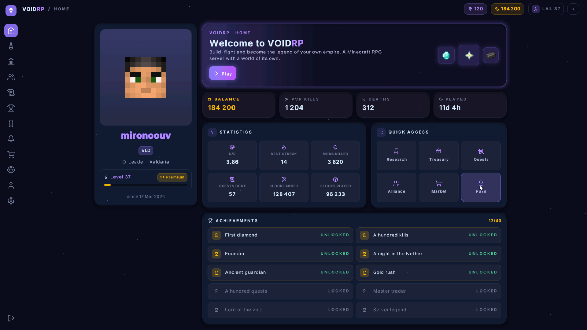
<sub>Так выглядит VoidRP UI на ванильном клиенте</sub>

### 🌱 Origins — ванильное выживание

Чистый **Paper 26.2**: без модов, модпака и обязательного лаунчера.

- 🔓 **Любой клиент** версий 1.21.1 – 26.x
- 🪟 **Вход окном Minecraft** с паролем от аккаунта VoidRP, регистрация прямо в игре
- 🧭 **Меню `/меню` на ванилле**: гайд, новости, топ игроков, настройки, RU/EN (клиент 1.21.6+)
- 🛒 **Рынок игроков** общий с сайтом: `/shop` прямо в игре
- 🏠 **Классика**: три дома, `/tpa`, PvP везде кроме спавна, вещи выпадают при смерти
- ⚠️ Приватов нет, но гриф и воровство запрещены правилами

**Адрес:** `origins.void-rp.ru:25567`

[](https://void-rp.ru/servers)

</td>
</tr>
</table>

<a id="start"></a>

## 🚀 Как начать играть

| | 🏰 VoidRP | 🌱 Origins |
|---|---|---|
| **1** | [Зарегистрируйся на void-rp.ru](https://void-rp.ru/register): это аккаунт для всех серверов | [Зарегистрируйся на void-rp.ru](https://void-rp.ru/register) или прямо в игре |
| **2** | [Скачай лаунчер](https://void-rp.ru/download-launcher) (Windows, Linux) | Открой Minecraft 1.21.1 – 26.x в любом лаунчере |
| **3** | Выбери сервер **VoidRP** и нажми «Играть»: модпак, Java и вход подтянутся сами | Добавь сервер `origins.void-rp.ru:25567` и введи пароль в окне входа |

> [!TIP]
> Через лаунчер VoidRP на Origins можно зайти без пароля: одноразовый билет входа едет прямо в адресе подключения.
> Гайды по серверам лежат на [void-rp.ru/server-guide](https://void-rp.ru/server-guide), сервер выбирается в шапке сайта.

<a id="screenshots"></a>

## 🖼️ Скриншоты из игры

<div align="center">

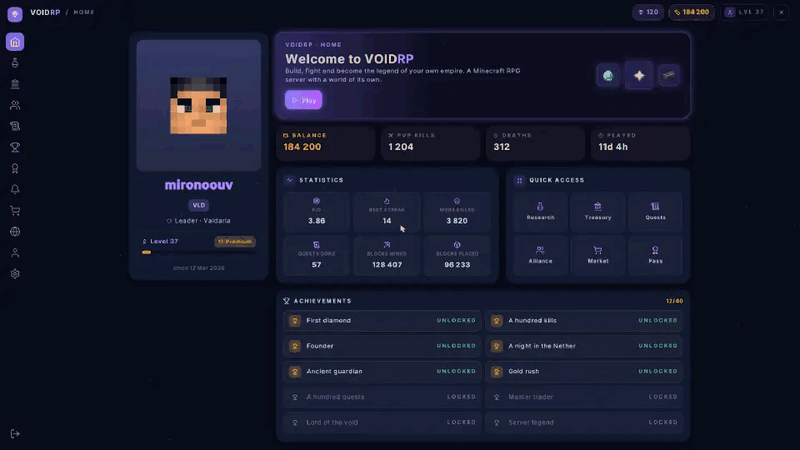

<sub>Ванильный клиент, запись в реальном времени. Игрок поворачивает голову, курсор идёт следом, и подсвечивается то, на что он наведён.<br>
Это не мод и не макет: каждый прямоугольник, буква и иконка приходят с сервера строкой текста в невидимом боссбаре.</sub>

</div>

### Одна страница, четыре темы

<div align="center">
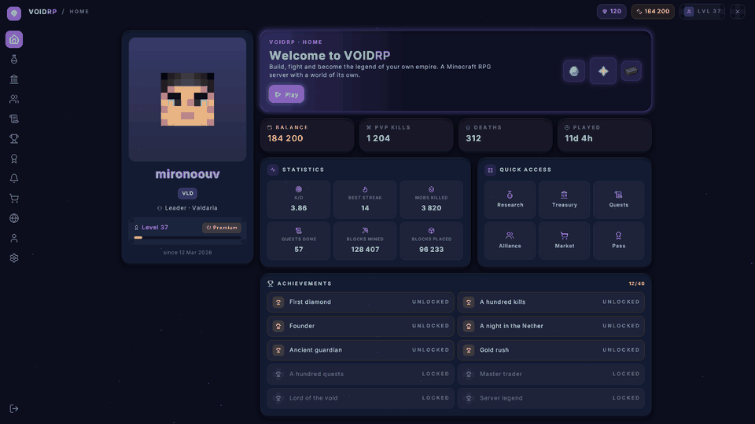

<sub>Тот же код, другой <code>theme.yml</code>: midnight → daylight → ember → grove</sub>
</div>

<details>
<summary><b>Все четыре темы крупно</b></summary>
<br>

<table>
<tr>
<td width="50%">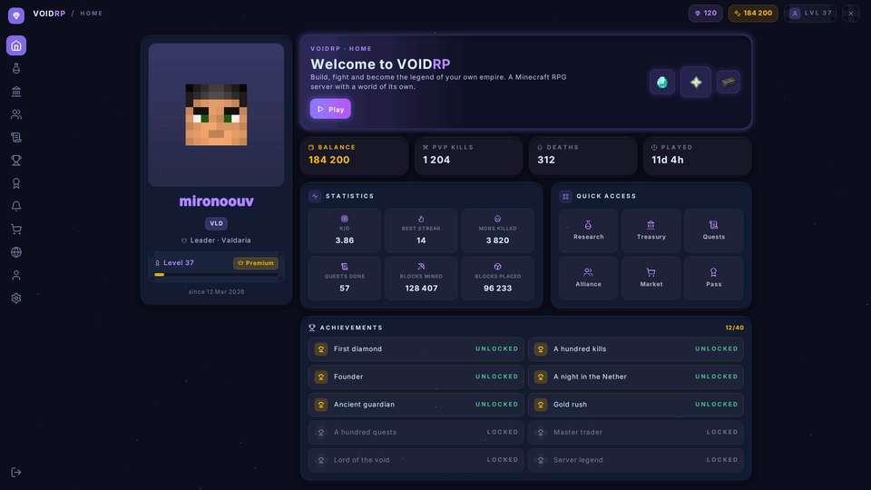<br><b>midnight</b>: почти чёрная с фиолетовым, по умолчанию</td>
<td width="50%">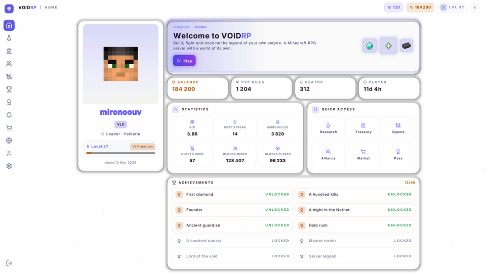<br><b>daylight</b>: светлая</td>
</tr>
<tr>
<td width="50%">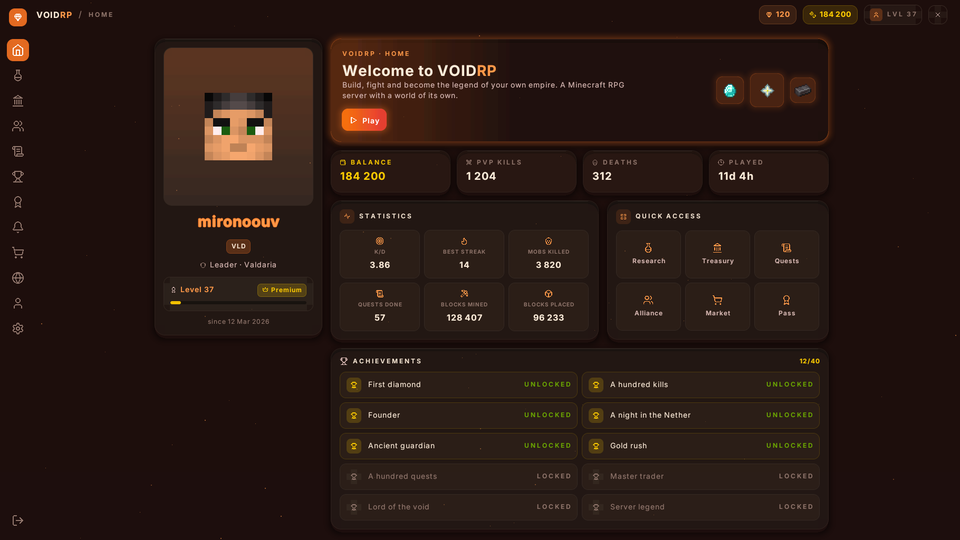<br><b>ember</b>: тёплая тёмная</td>
<td width="50%">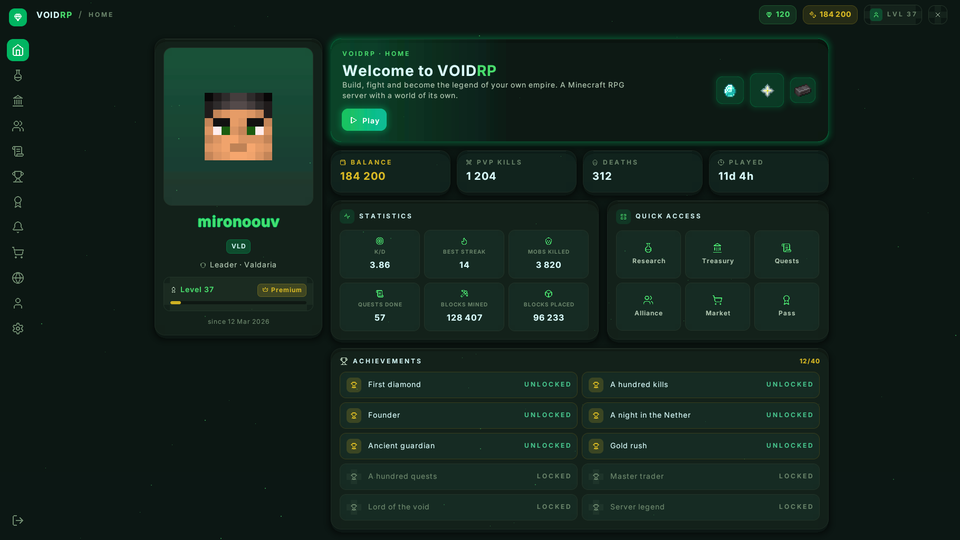<br><b>grove</b>: тёмно-зелёная</td>
</tr>
</table>

</details>

<details>
<summary><b>Компоненты: кнопки, переключатели, слайдеры, вкладки, диалоги</b></summary>
<br>

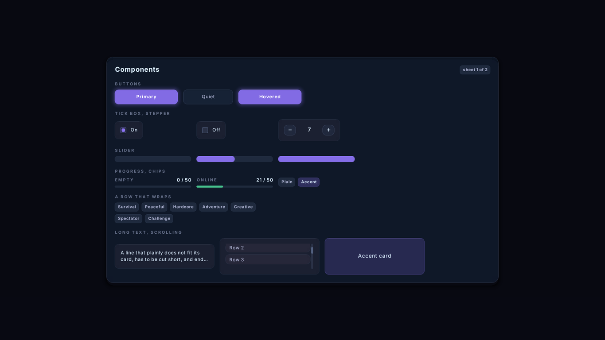
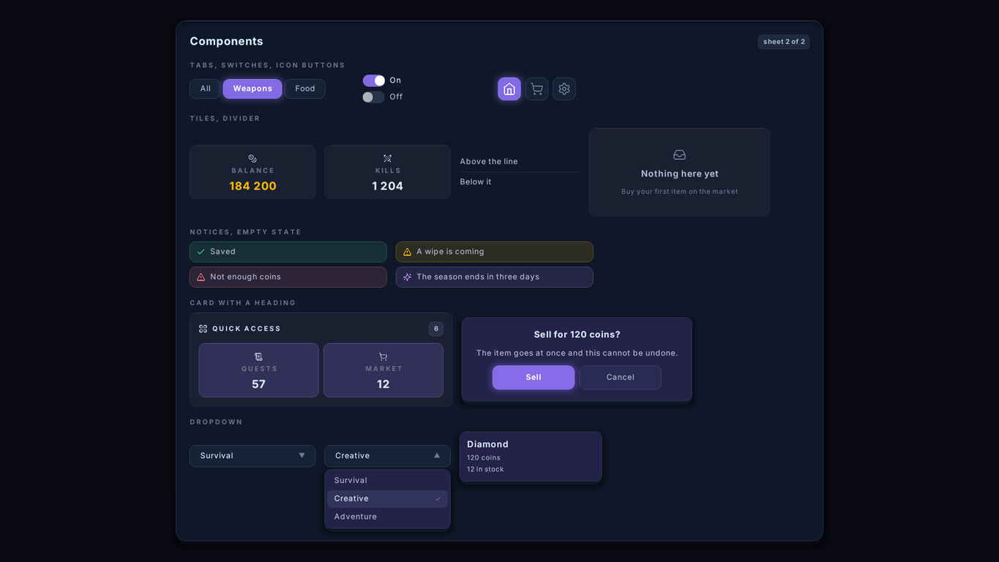

</details>

<a id="voidrp-ui"></a>

## ✨ VoidRP UI — настоящие интерфейсы на ванильном клиенте

Обычно интерфейс сервера в Minecraft — это сундук с предметами, а всё сложнее требует клиентского мода.
[**VoidRP UI**](https://github.com/VOIDRP-MINECRAFT/voidrp-ui) рисует панели со скруглениями, прозрачностью,
шрифтом Inter, иконками предметов и живым курсором **на обычном клиенте**: игрок заходит как есть и
принимает ресурспак сервера. Страница пишется кодом и собирается на сервере в момент показа,
поэтому показывает данные, которых не было при сборке пака.

<table>
<tr>
<td valign="top">

**Скачать**

- [Modrinth](https://modrinth.com/plugin/voidrp-ui)
- [Hangar](https://hangar.papermc.io/mironoouv/VoidRP-UI)
- [GitHub Releases](https://github.com/VOIDRP-MINECRAFT/voidrp-ui/releases/latest): готовый jar
- [JitPack](https://jitpack.io/#VOIDRP-MINECRAFT/voidrp-ui): зависимость для своих плагинов

</td>
<td valign="top">

**Совместимость**

- Сервер: **Paper** (API 26.2; jar собран под Java 21 и грузится на 1.21.6)
- Клиенты: **1.21.6 – 26.x**, для старых и новых собираются два ресурспака
- Моды игроку не нужны, лицензия **MIT**
- [PacketEvents](https://modrinth.com/plugin/packetevents) по желанию: курсор отзывчивее до 50 мс

</td>
<td valign="top">

**Документация**

- [Layout](https://github.com/VOIDRP-MINECRAFT/voidrp-ui/blob/main/docs/layout.md): панели, сетки, скролл
- [Pages](https://github.com/VOIDRP-MINECRAFT/voidrp-ui/blob/main/docs/page.md): состояние, события, API
- [Components](https://github.com/VOIDRP-MINECRAFT/voidrp-ui/blob/main/docs/components.md): кнопки, вкладки, диалоги
- [Theming](https://github.com/VOIDRP-MINECRAFT/voidrp-ui/blob/main/docs/theming.md): темы и токены
- [Responsive](https://github.com/VOIDRP-MINECRAFT/voidrp-ui/blob/main/docs/responsive.md): под экран игрока
- [Internals](https://github.com/VOIDRP-MINECRAFT/voidrp-ui/blob/main/docs/internals.md): как устроен трюк

</td>
</tr>
</table>

<a id="architecture"></a>

## 🏗️ Архитектура

<div align="center">
<picture>
  <source media="(prefers-color-scheme: dark)" srcset="diagrams/architecture-dark.svg">
  
</picture>
</div>

<sub>Исходники схем лежат в [`profile/diagrams/*.puml`](diagrams) (PlantUML). На стрелках подписан протокол или секрет, по которому идёт обмен.</sub>

<details>
<summary><b>🔐 Единый аккаунт, разделённые миры</b></summary>
<br>

Аккаунт-слой (`users` / `player_accounts`) **глобальный**: один логин, профиль, скин и донат на всю
платформу. Игровая механика скоупится по `server_id → game_servers` (30+ таблиц: нации, экономика,
статистика, античит…). Какие разделы показывать для сервера (моды, рынок, апгрейдер, торговец, нации,
боевой пропуск), решают флаги `game_servers.features`. Сервер определяется двумя путями:

- **плагины и моды**: по заголовку `X-Game-Auth-Secret`, у каждого сервера свой секрет;
- **сайт и лаунчер**: `?server=<slug>` → `X-Server-Slug` → сервер по умолчанию.

</details>

<details>
<summary><b>🚀 Лаунчер: манифест, синхронизация, помощь при крашах</b></summary>
<br>

Лаунчер состоит из трёх процессов: Vue 3 renderer, Electron и CoreHost на .NET 8. Он тянет **манифест пака**
(бэкенд генерирует его из `pack_root`, URL лежит в `game_servers.manifest_url`) и сверяет локальные файлы:

- качает **до 8 файлов параллельно** (HTTP/2), кэш SHA-256 не пересчитывает хеши без нужды;
- флаги файла: `alwaysOverwrite` перезаписывает всегда, `managed` синхронизирует по хешу; `config/` сверяется
  по доставленным хешам, а клавиши и настройки графики игрока не перезаписываются;
- файлы каждого сервера изолированы в `servers/<slug>/`, папку игры можно выбрать в настройках;
- **краш-советник**: перед запуском проверяет память и диск, после краша сверяет лог с правилами,
  которые присылает сервер, и предлагает кнопки-исправления.

</details>

<details>
<summary><b>🎫 Вход без передачи пароля в игру</b></summary>
<br>

- **Модовый сервер.** Лаунчер по JWT получает у бэкенда одноразовый `play-ticket` с коротким TTL,
  `auth-bridge` проверяет его при подключении и получает профиль, привязанный к `server_id`.
- **Плагинный сервер (Origins).** Игрок из лаунчера входит сразу: билет приходит меткой в адресе подключения.
  С обычного клиента `voidrp-auth-plugin` ещё до входа в мир показывает **нативное окно Minecraft**
  «Вход на VoidRP», а пароль проверяет сайт: сервер его не хранит, AuthMe и вторая база паролей не нужны.
- Билет выдаётся только после принятия актуальной оферты и согласия на обработку персональных данных.

<div align="center">
<picture>
  <source media="(prefers-color-scheme: dark)" srcset="diagrams/flow-auth-launch-dark.svg">
  
</picture>
</div>

</details>

<details>
<summary><b>🖥️ Интерфейсы: WebGUI и VoidRP UI</b></summary>
<br>

- **Модовый клиент.** HTML/Vue-страницы поверх игры во встроенном Chromium (MCEF). Сервер шлёт `webgui:open_web`
  с URL и `webgui_token` (HMAC-SHA256), клиент открывает `void-rp.ru/game-ui/*`, страница ходит в
  `/api/v1/game-ui/*`. Есть HUD с уведомлениями, гайд новичка и дорожная карта.
- **Ванильный клиент.** [VoidRP UI](#voidrp-ui): страница едет строкой текста в невидимом боссбаре,
  и её рисует подменённый текстовый шейдер из ресурспака.

</details>

<details>
<summary><b>💹 Мод-прокси-шоп, экономика и торговец</b></summary>
<br>

На Mohist магазин EconomyShopGUI не умеет модовые предметы, поэтому `gamesync-plugin` перехватывает транзакции,
берёт цену из динамического рыночного кэша бэкенда и выдаёт предмет через `minecraft:give`. Сделки на рынке
игроков идут с комиссией 2% (1% с Premium) и засчитываются в боевой пропуск и квесты. По расписанию на спавне
появляется **странствующий торговец** (NPC Citizens): редкие лоты, бюджет выплат, ассортимент открывается
по уровню боевого пропуска.

</details>

<details>
<summary><b>🛡️ Античит и производительность</b></summary>
<br>

Серверный `anticheat` копит нарушения (Speed, Fly, Reach, KillAura, CPS) в VL и шлёт в бэкенд репорты и снимки
списка модов клиента; админ выносит вердикты по модам. В `async-ai` 65 миксинов: 23 из них закрывают пути
к chunk-deadlock, остальные дают async pathfinding, троттлинг AI и защиту от падений сторонних модов.
`client-fixes` чинит клиентские краши модпака и не нужен на сервере. Вотчдог ловит зависания и краши сервера,
собирает диагностику и может позвать Claude; включается из админки.

</details>

<a id="repositories"></a>

## 📦 Репозитории

### 🖥️ Платформа

| Репозиторий | Что делает | Стек |
|---|---|---|
| [**minecraft-backend**](https://github.com/VOIDRP-MINECRAFT/minecraft-backend) | REST API платформы: аккаунты, мультисервер, нации, экономика, торговец, согласия, античит, админка, мониторинг серверов | Python · FastAPI · PostgreSQL · Alembic |
| [**voidrp-site**](https://github.com/VOIDRP-MINECRAFT/voidrp-site) | Сайт void-rp.ru: профили, нации, магазин, рынок, гайды, рейтинги, админка и in-game страницы `/game-ui/*` | Vue 3 · Vite · Tailwind · daisyUI · RU/EN |

### 🚀 Лаунчеры

| Репозиторий | Что делает | Стек |
|---|---|---|
| [**voidrp-launcher-vue**](https://github.com/VOIDRP-MINECRAFT/voidrp-launcher-vue) | Основной лаунчер: выбор сервера, синхронизация модпака, Java, play-ticket, краш-советник, самообновление | Electron · Vue 3 · TypeScript · .NET 8 |
| [**voidrp-launcher-java**](https://github.com/VOIDRP-MINECRAFT/voidrp-launcher-java) | Запасной лаунчер одним fat JAR, если Electron недоступен | Java 21 · JavaFX · OkHttp |

### 🌱 Плагины для ванильных серверов

| Репозиторий | Что делает | Платформа |
|---|---|---|
| [**voidrp-ui**](https://github.com/VOIDRP-MINECRAFT/voidrp-ui) ⭐ | Интерфейсы на ванильном клиенте без модов: страницы в коде, курсор, темы, компоненты, API для своих плагинов. [Modrinth](https://modrinth.com/plugin/voidrp-ui) · [Hangar](https://hangar.papermc.io/mironoouv/VoidRP-UI) | Paper 26.2 · Kotlin · MIT |
| [**voidrp-auth-plugin**](https://github.com/VOIDRP-MINECRAFT/voidrp-auth-plugin) | Вход и регистрация через аккаунт сайта нативными окнами Minecraft; из лаунчера вход мгновенный | Paper 26.2 · Java 25 |

### ⚔️ NeoForge-моды (VoidRP, 1.21.1)

| Репозиторий | Что делает | Где стоит |
|---|---|---|
| [**voidrp-async-ai**](https://github.com/VOIDRP-MINECRAFT/voidrp-async-ai) | Производительность: async pathfinding, троттлинг AI, 65 миксинов против chunk-deadlock и крашей модов | сервер |
| [**voidrp-anticheat**](https://github.com/VOIDRP-MINECRAFT/voidrp-anticheat) | Speed, Fly, Reach, KillAura, CPS, снимок модов клиента и детект инжектов | сервер + клиентская часть |
| [**voidrp-auth-bridge**](https://github.com/VOIDRP-MINECRAFT/voidrp-auth-bridge) | Вход по play-ticket, переподключения, система скинов с мгновенной сменой | клиент + сервер |
| [**voidrp-webgui-neoforge**](https://github.com/VOIDRP-MINECRAFT/voidrp-webgui-neoforge) | Встроенный Chromium (MCEF): страницы и HUD поверх игры, события страница ↔ сервер, горячие клавиши | клиент + сервер |
| [**voidrp-cpm-companion**](https://github.com/VOIDRP-MINECRAFT/voidrp-cpm-companion) | Косметика через Customizable Player Models: выдача, экипировка, сборка модели со скином | сервер (+ CPM) |
| [**wg-region-guard**](https://github.com/VOIDRP-MINECRAFT/wg-region-guard) | Не даёт механикам модов (Create, Mekanism, взрывы, боссы…) ломать регионы WorldGuard | сервер (Mohist) |
| [**voidrp-client-fixes**](https://github.com/VOIDRP-MINECRAFT/voidrp-client-fixes) | Crash-guard'ы и совместимость клиентских модов модпака | только клиент |

### 🔌 Paper-плагины (VoidRP, Mohist 1.21.1)

| Репозиторий | Что делает |
|---|---|
| [**voidrp-gamesync-plugin**](https://github.com/VOIDRP-MINECRAFT/voidrp-gamesync-plugin) | Сердце сервера: синхронизация с бэкендом, прокси-шоп модовых предметов, рынок игроков, WebGUI-мост, торговец, гайд новичка, косметика |
| [**voidrp-battlepass**](https://github.com/VOIDRP-MINECRAFT/voidrp-battlepass) | Боевой пропуск: сезоны, Free/Premium, 100 уровней и престиж, награды в Void Coins, x2 XP по выходным |
| [**voidrp-daily-quests**](https://github.com/VOIDRP-MINECRAFT/voidrp-daily-quests) | Ежедневные квесты, трёхдневное «Испытание героя» и задания на доставку, синхронизация с WebGUI |
| [**voidrp-wealth-tax**](https://github.com/VOIDRP-MINECRAFT/voidrp-wealth-tax) | Прогрессивный налог на богатство, собранное идёт в казну нации |
| [**voidrp-mod-sell**](https://github.com/VOIDRP-MINECRAFT/voidrp-mod-sell) | Продажа модовых предметов командой `/modsell` с лимитами и засчитыванием в квесты |

<sub>🗄️ В архиве: [voidrp-webgui](https://github.com/VOIDRP-MINECRAFT/voidrp-webgui), Fabric-форк WebGUI, его заменил voidrp-webgui-neoforge.</sub>

<a id="developers"></a>

## 🧑‍💻 Для разработчиков

<details open>
<summary><b>VoidRP UI: страница в пятнадцать строк (Kotlin)</b></summary>
<br>

```kotlin
class ShopPage(private val balance: Int) : Page() {

    override fun view(): View = Panel(
        style = Theme.page,
        width = Size.Fixed(600),
        gap = Theme.SPACE_4,
        children = listOf(
            Text("Shop", Theme.TEXT_H2, Theme.INK, Weight.SEMIBOLD),
            Text("Balance: $balance", Theme.TEXT_BODY, Theme.INK_SOFT),
            Panel(
                direction = Direction.ROW,
                gap = Theme.SPACE_3,
                align = Align.CENTER,
                children = listOf(Image("diamond", 32), Text("Diamond — 100")),
            ),
            button("Buy", id = "buy"),
        ),
    )

    override fun onClick(id: String, button: Button) {
        if (id == "buy") { /* ... */ refresh() }
    }
}

plugin.pages.open(player, ShopPage(balance))
```

Подключение к своему плагину через JitPack:

```kotlin
repositories { maven("https://jitpack.io") }

dependencies {
    compileOnly("com.github.VOIDRP-MINECRAFT:voidrp-ui:v0.3.17")
}
```

</details>

<details>
<summary><b>WebGUI: открыть страницу сайта в игре из Paper-плагина (Java)</b></summary>
<br>

```java
// Полноэкранный интерфейс поверх игры
webGuiBridge.openGui(player, "https://void-rp.ru/game-ui#market");

// HUD-оверлей
webGuiBridge.openHud(player, "https://void-rp.ru/game-ui/hud");

// Что открывается по клавише F6
webGuiBridge.sendMainMenuUrl(player, "https://void-rp.ru/game-ui/menu");
```

`signUrl(url)` сам добавляет `?webgui_token=<HMAC-SHA256>`, по нему страница авторизуется в API.

</details>

<details>
<summary><b>WebGUI: события между сервером и страницей (Java ↔ JS)</b></summary>
<br>

```java
// Сервер → страница
WebviewApi.emitToPage(player, "market:order_filled", "{\"item\":\"iron\",\"amount\":64}");
```

```js
// Страница слушает событие…
window.addEventListener("webgui:market:order_filled", e => showNotification(e.detail));

// …и отвечает серверу
window.webgui.postToServer("buy_clicked", JSON.stringify({ itemId: "iron_sword" }));
```

</details>

> [!NOTE]
> Как собрать любой репозиторий, как устроены API, play-ticket и WebGUI — в [документации для разработчиков](https://github.com/VOIDRP-MINECRAFT/.github/tree/main/docs).
> Хотите помочь? [CONTRIBUTING](https://github.com/VOIDRP-MINECRAFT/.github/blob/main/CONTRIBUTING.md) · уязвимости — приватно по [SECURITY](https://github.com/VOIDRP-MINECRAFT/.github/blob/main/SECURITY.md).

## 📊 В цифрах

<div align="center">

| 🌍 Серверов | 🧩 Своих модов и плагинов | ⚙️ Миксинов в async-ai | 🗃️ Таблиц со `server_id` | 🧱 Миграций БД | 🎨 Иконок в VoidRP UI |
|:---:|:---:|:---:|:---:|:---:|:---:|
| **2** | **15+** | **65** | **30+** | **93** | **788** |

</div>

- ✅ **Мультисервер**: общий аккаунт и отдельные игровые данные у каждого сервера
- ✅ **UI на ванильном клиенте**: страницы кодом через боссбар и шейдеры, без модов
- ✅ **Вход окнами Minecraft**: серверные диалоги 1.21.6+ поверх аккаунта сайта
- ✅ **23 chunk-guard-миксина**: закрыты пути к зависанию главного потока
- ✅ **Mod proxy shop**: модовые предметы в Paper-магазине без рестарта
- ✅ **Краш-советник**: правила крашей от сервера и исправление в один клик
- ✅ **AI-вотчдог**: ловит зависания и краши, собирает диагностику и зовёт Claude
- ✅ **Play-ticket**: при входе из лаунчера пароль не попадает в игру

---

<div align="center">

**[🌐 Сайт](https://void-rp.ru)** · **[🖥️ Серверы](https://void-rp.ru/servers)** · **[📥 Лаунчер](https://void-rp.ru/download-launcher)** · **[🗺️ Карта](https://void-rp.ru/map)** · **[💬 Discord](https://discord.gg/j2Dvxm8E)** · **[✈️ Telegram](https://t.me/voidRPminecraft)** · **[🟢 Modrinth](https://modrinth.com/plugin/voidrp-ui)**

<sub>VoidRP — твой мир, твои правила</sub>

</div>
